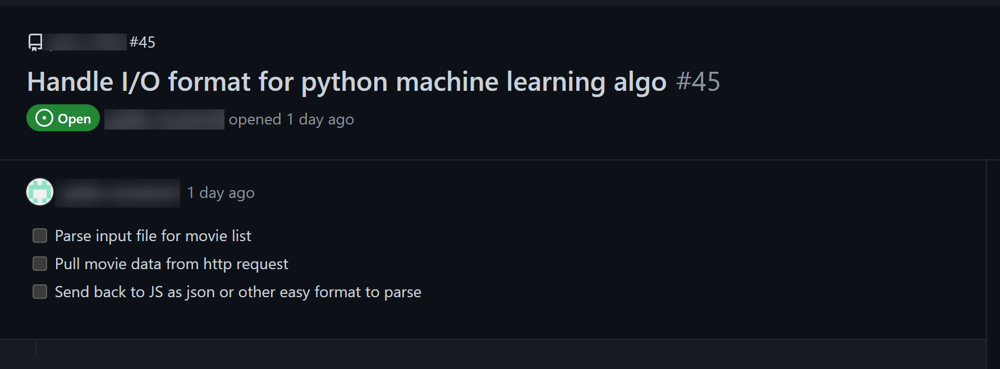
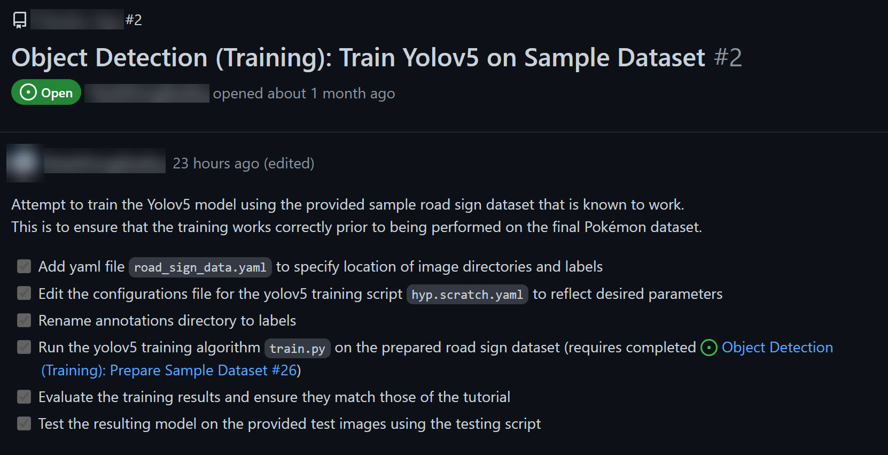

# Acceptance Criterion

## Overview

Acceptance criterion are meant to allow the person that pulled the story and other members of the team to understand (and discuss) what must be done for a story to considered complete.  By having acceptance criterion it makes it clear what will be done and therefore what won't be done in a story.  

Remember the idea is that the person that pulled the story  doesn't get to close the story without feedback and agreement from other team members (that is agile transparency and visibility).  One or two others on the team review the acceptance criterion to agree that this story is actually complete.  

## Who creates the acceptance criterion?

Primarily, the product owner will create the acceptance criterion.  If your team doesn't have a product owner (in this course there isn't a product owner on the team) than the person pulling the story can create acceptance criterion.

## When are acceptance criterion created?

As the story approaches the top of the (prioritized) backlog the story should have the acceptance criterion defined.  

## My story doesn't have acceptance criterion

What if a story I pulled (or created) doesn't have acceptance criterion?  You should create them.  Really?  Yes!  Ask yourself what has to be done for this story to considered complete?  Be concrete,  specific and think step-by-step.  You don't have to have every minuscule detail for every single step:

### Too much

- open the code editor
- create a variable.  
  
But you should have the big basics:

### Just about right

- grab the search term from the web page
- connect to the database
- execute database query
- display query results in web page

## Student Examples

### Student example #1

### Student example #2

